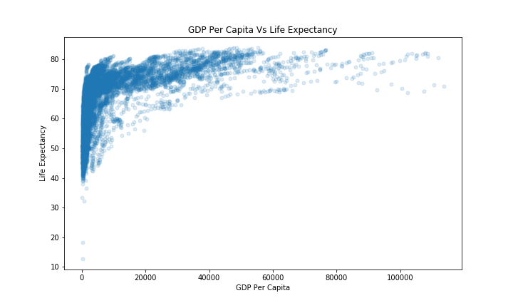
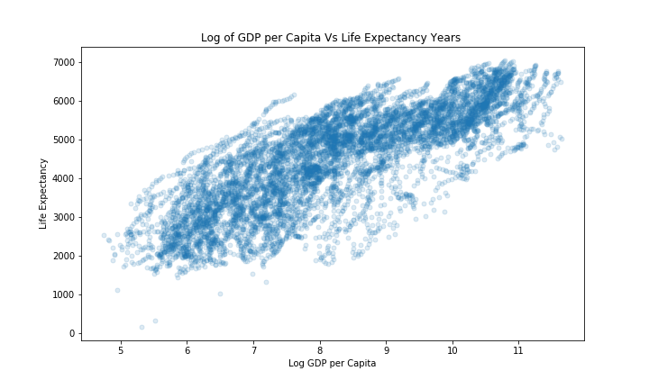
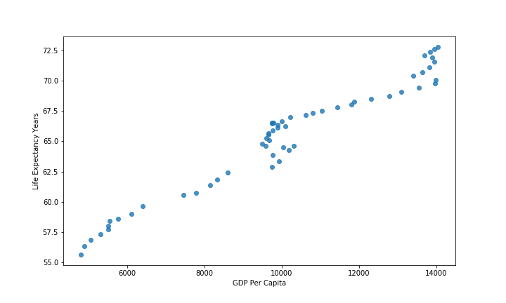
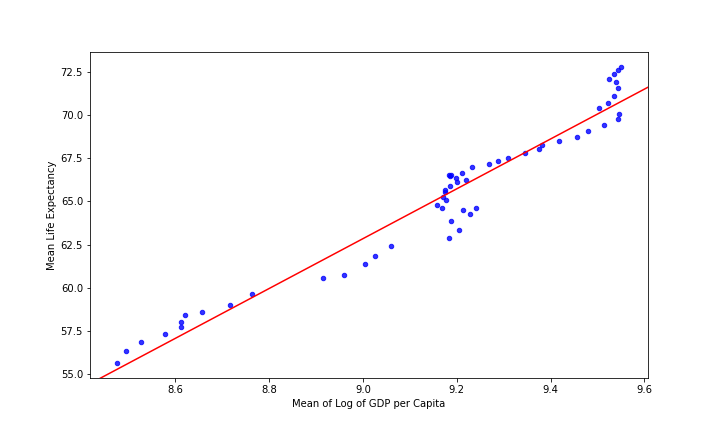
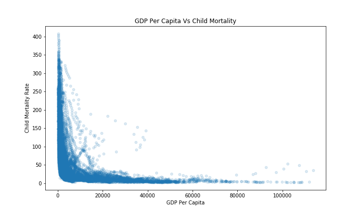
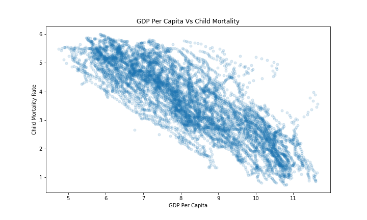
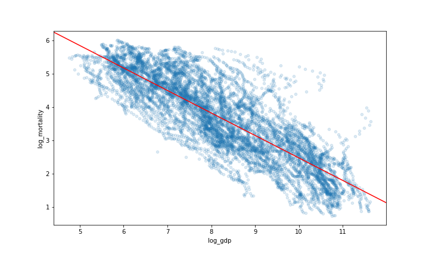
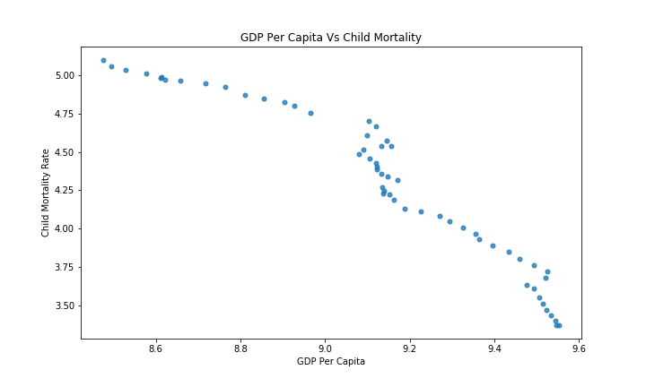
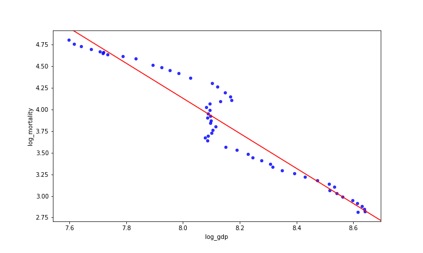

# DS-5500-HW 2

## Solution 2:

For this problem, I compared my visualization to that of Monica Mishra.

Link: https://colab.research.google.com/drive/1v8EY74vQxPubjXHywpDUYo7a3FMj-GuB

The similarity for the whole comparision is that we've both used world4_region file to get the distribution around 4 regions. The plot used for comparison across continents is similar except for nature of plot. We've both used interactive plots for comparing distribution across countries.

For visualization the distribution of income (GDP / capita) across continents, the major difference in our plot is that my plot is static while her's is interactive. It's really interesting to see this interactive plot where you can hover on the line and see the continent other than the legend which makes it visually appealing.  
Monica has used a different time range (1800-2000) and (2000-2040) and shown the change over time using two different graphs while I've used one static plot for the time range (1960 to Present). Monica's plot is very easy to interprete with well defined X-axis and Y-axis along with appropriate color scheme for the continents while it is little confusing to understand the Y-axis values. The obersvations Monica made for different time schemes are interpretable.

For visualization of distribution of income (GDP / capita) across countries, we've both used interactive plots but the way we've applied it is very different. It is interesting to see the line plot Monica has used for this task. One plot shows change in GDP per Capita over time for all countries wherease the other one shows the same for African countries. While it is easy to interprete the values of each axis but at the same time, it is difficult to comprehend the visualiztion over countries as there are so many countries, on hovering it shows the label of all countries where few countries seem to have same color possibly due to limited color pallet of the library. For this problem, I believe the plot I've used where all the countries are on a map and change over time can be seen through color scheme is more effective.

## Solution 3:

For this problem, I compared my visualization to that of Rutu Nanavati

Link: https://github.com/nanavatirutu/DS5500

The similarity in our visualization is that we've used static plots to answer the question. The time range selected on X-axis is also similar. The differences are again the way we've implemented the plots. Rutu has used three different plots with one Y-axis while I've used five plots each with multiple Y-axes. Rutu has compared the target variables across time for six different continenets while I've processed it down to four.

Rutu has seperately ploted GDP (Income) per Capita with time, Life Expectancy with time and Infant Mortality Rate with time for six continents which is easily interpretable. The X-axis being time and Y-axis being the target variable along with lines of different color showing the trend in those continents. Legend is also very useful to identify the continent. My approach is different because I've plotted GDP (Income) per Capita with time, Life Expectancy with time and Infant Mortality Rate on same graph but with multiple Y-axis which are easily identifiable by color scheme. I've used world4_region file to get data for four continents and then potted the comparison for each continent and one as overall aggregate of all continents.
It is difficult to identify the better method here as both the solutions look reasonable for a static plot approach, however I believe the plot I've used compare all three variables on same plot which makes it easy to compare the trend among themselves over the time while for Rutu's plot, it is easy to see the trend for each variable across different continents simaltaneously.

## Solution 4:

Here, we're investigating the relationship between GDP per Capita and Life Expectancy. For the experiment, I'll consider GDP per Capita as X and Life Expectancy as Y because my assumption is as Income increases, people can afford better health care and get a better standard of living overall which might result into average Life Expectancy of a person. I also believe that this relationship cannot be perfectly linear as there will be an upper limit in age and as the Life Expectancy increases, the rate of increase after one point will be slow as it reaches that upper limit of age.

###### Figure 1: Scatter Plot for GDP per Capita and Life Expectancy

As observed from the plot below, In the raw data for all countries, the data is densely populated and the relationship is not linear and hence this confirms one of the assumptions that age cannot increase beyond a value which could be a possible explanation behind this. Now to proceed further, the data would require a transformation. Given the nature of the graph, the choice would be log-transformation  

###### Figure 2: Scatter Plot for log-transformed GDP per Capita and Life Expectancy
The plot now shows a better relationship between both variables which would be more useful in identifying a relationship between them and now we can try our first model.

###### Figure 3: Statistics for First Model

Using X ~ Log (GDP per Capita) and Y ~ Life Expectancy in Years, for the data the Adj. R-Squared value obtained is 0.616 which is mainly because data is still not completely good for regression. The reasons behind that are it doesn't capture enough variables as a predictor, and the data wrangling can be performed more efficiently as here we've data corresponding to each country and continent for each year, this data doesn't capture a strong relationship without these transformations.

###### Figure 4: Fit for First Model on Data

For the former reason, I added the variable of time to the model. Time is an important factor here as over the time as GDP per Capita as well as Life Expectancy both have shown monotonically increasing trend. The possible reason could be as GDP per Capita increases with time, people can invest more in healthcare and get better services overall. The sanitary conditions also improve which explains that one of the other assumptions might also be true. 
Here are the results for Linear Regression with Multiple Variable

###### Figure 5: Summary for First Model with Time as another variable.

The Adj. R-Squared has improved to ~0.70 with the inclusion of time.

To add more layer of data wrangling, I tried to get the mean of GDP per Capita and Life Expectancy across all countries for a given year. The distribution looks as follows:

###### Figure 5: Scatter Plot for Mean GDP per Capita and Mean Life Expectancy
It looks good and shows an almost linear relationship between the two variables, thus next step would be to model them directly for the transformed dataset.

###### Figure 6: Statistics for the model with Mean GDP per Capita and Mean Life Expectancy

Here, the Adj. R-Squared is very high (~0.955), upon further inspection we can observe that coefficient of GDP per Capita is very low (~0.0016) which reduces it's effect to almost nil. Thus we need to try another transformation to get a better model.

Now, on exploring the relationship between Life Expectancy and log of GDP per Capita, we can see coefficient is positive which is expected out of it and Adj. R-Squared is still high of (~0.946). This model achieved the best performance among the other but again it lacks information about the data which can help us in identifying the true relationship between the two variables.

###### Figure 7: Statistics for the model with Log of Mean GDP per Capita and Mean Life Expectancy

###### Figure 8: Fit for the best model

The major challenge here is to somehow capture the relationship which has many dimensions and factors such as the distribution of income which is not known. It is challenging to incorporate all information in our model. It would make more sense to perform the analysis for a given country and observe the trend. It'll help us in identifying the general case as well as the outliers where we might see a negative relationship between two variables due to factors such as the distribution of income.

The final equation would be Y ~ X + c where
Y: Average Life Expectancy
X: Average GDP per Capita for each year

## Solution 5

In this problem, we've to identify the relationship between GDP per Capita and Child Mortality Rate. In general, the trend we can expect is a negative relationship between GDP Growth and Child Mortality

Here's what the scatter plot looks like:

###### Figure 9: Relationship between GDP per Capita and Child Mortality

This requires log transformation for both the variables. On transforming variables, the scatter plot shows a better relationship between the two variables.

###### Figure 10: Relationship between log-transformed GDP per Capita and Child Mortality

The workflow for this problem is very similar to the previous problem except for the transformations performed. Here, since we're expecting a negative correlation, the model is expected to have a negative coefficient for X.

As a baseline model, we'll run OLS regression on log-transformed values. The Adj. R-Squared is 0.69 which will be improved further. Again, here using only these two variables after performing log transformation is not a good idea as we've not considered other important factors.

###### Figure 11: Statistics for Log GDP per Capita and Log Child Mortality

###### Figure 12: Plot with the fit for Log GDP per Capita and Log Child Mortality

Now, adding time as a variable to the model, the Adj. R-Squared has improved considerably to 0.808 with coefficients of GDP per Capita as ~(-0.62) which is similar to the previous model but the added time factor also has a negative coefficient which has improved the model further. It can be understood that with time and an increase in GDP, the Child Mortality Rate has decreased with rise in awareness and better health and sanitation facilities available.

###### Figure 13: Statistics for Log GDP per Capita and Log Mean Child Mortality Rate along with time.

Another way to approach this could be to consider the aggregated values of GDP per Capita and Child Mortality Rate. From the data frame, we can achieve this by taking the mean values of each log-transformed variable for each year. This will give us a data frame with mean values for the corresponding year. The good think about this approach is it reduces the dimension of the dataset by incorporating the information from the table (by taking mean over time). Here's how the relationship looks after the aggregation.

###### Figure 13: Scatter plot for Mean GDP per Capita and mean Child Mortality Rate after log transformation

For the aggregated data, I tried simple Linear Regression on both variables to see how it performs and captures the relationship between those two. The Adj. R-Squared has again increased and improved to 0.919 and the coefficient of the mean of log-transformed GDP per Capita has also reduced to ~(-2.02) which shows that it has improved from the previous model

###### Figure 14: Statistics for the best model

On observing the fit, we can say it looks very close to linear graph with a slope greater than 90 degrees which shows the negative relationship but the drawback again would be not considering certain factors that are important to this along with GDP per Capita. It is not the best method to aggregate as it doesn't tell us about the distribution of income but overall gives a good sense of the relationship between the two variables.

The equation for this relationship can be: mean(log(X)) ~ mean(log(Y)) + c for a given year.

###### Figure 15: Fit for the best model
.
